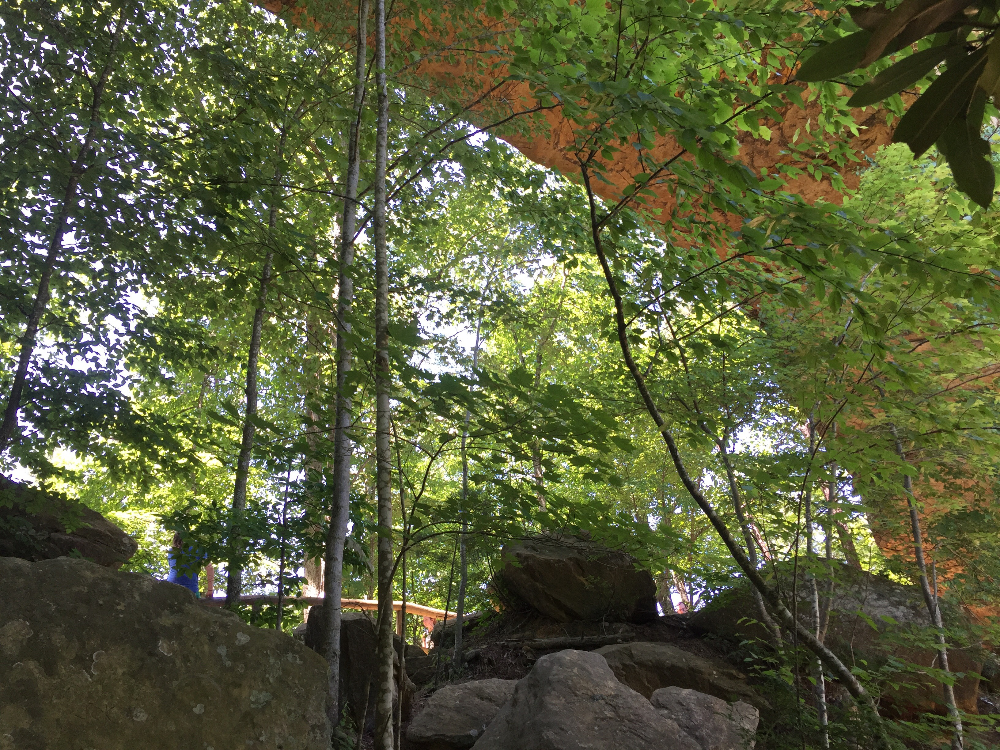
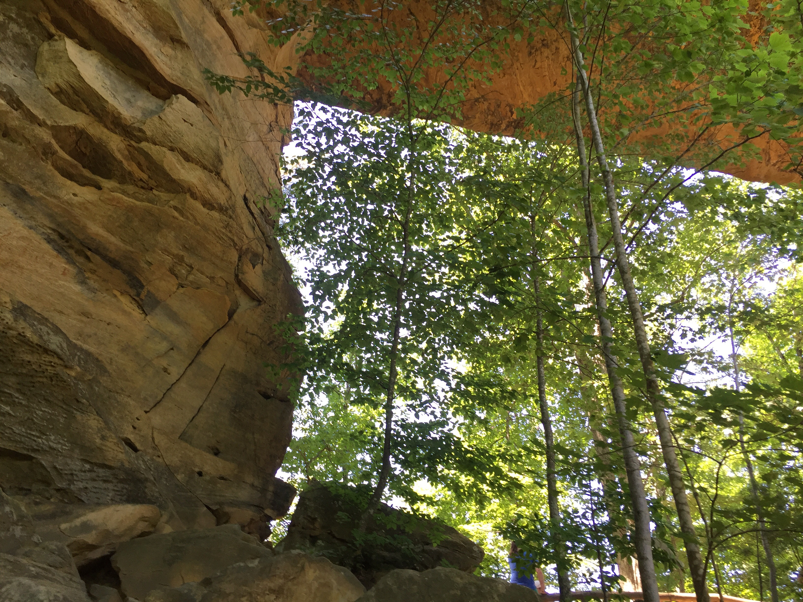
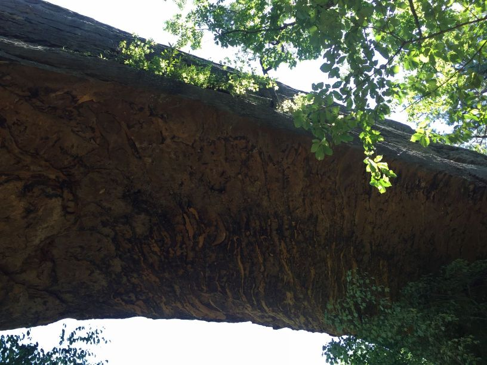
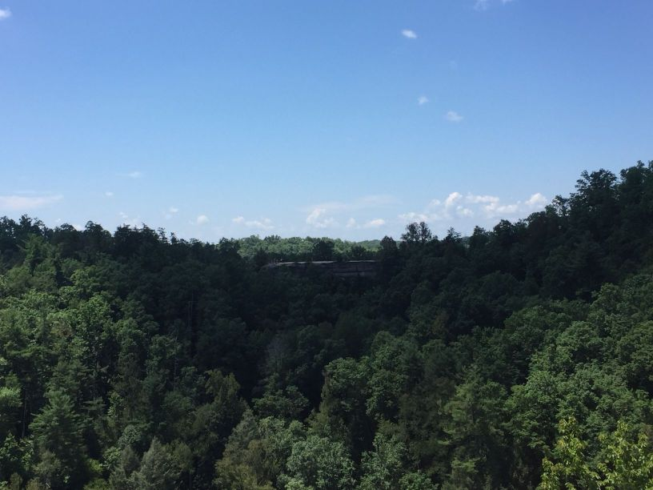

# Field Report
Name: Emmanuel Banjoko
Date: May 6th, 2019 
Location: Natural Bridge

Feature is at the forefront and near the most tourism-centric part of the trail and the estimated size is a feature that spans approximately 78 ft wide.

Underneath right side of Natural Bridge

Underneath left side of Natural Bridge

Photo of what I indicated to be some type of Karst Landforms undearneath Natural Bridge

