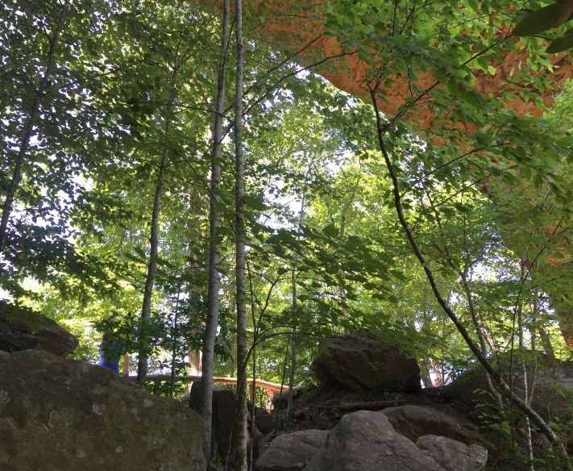

# Field Report
Name: Emmanuel Banjoko
Date: April 21st, 2019 
Location: Natural Bridge

Feature is at the forefront and near the most tourism-centric part of the trail and the estimated size is a feature that spans approximately 78 ft wide.

